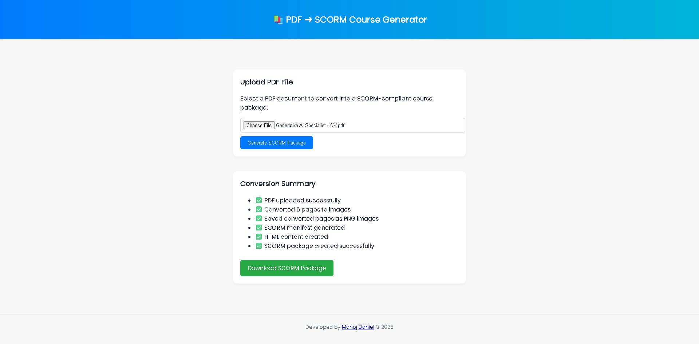

# 📚 PDF-to-SCORM Course Generator  


> 🧠 **A lightweight Flask application that converts PDF files into SCORM-compliant eLearning packages — ready for upload to any LMS (Moodle, Canvas, Blackboard, etc.)**

---

## 🚀 Features

- 📂 **Upload Any PDF File** – Converts your training documents or manuals into course slides.  
- 🖼️ **Auto Image Conversion** – Uses `pdf2image` + `Pillow` to render each PDF page into an image.  
- 📦 **SCORM Package Generation** – Automatically creates a ZIP-compliant SCORM 1.2/2004 structure.  
- 🧾 **Dynamic Metadata** – Adds unique UUID and manifest for LMS compatibility.  
- ⚙️ **Cross-Platform Support** – Works on Windows, macOS, and Linux.  

---

## 🧰 Tech Stack

| Component | Technology |
|------------|-------------|
| Framework | Flask |
| PDF Processing | pdf2image |
| Image Rendering | Pillow |
| Compression | zipfile |
| System Tools | Poppler, platform, tempfile |

---

## 📦 Installation


⚙️ System Requirements
| Component | Version                   |
| --------- | ------------------------- |
| Python    | 3.9+                      |
| Flask     | 2.2.2                     |
| pdf2image | 1.16.3                    |
| Pillow    | 10.0.0                    |
| Poppler   | Installed & added to PATH |

## 🖼️ Project Screenshots
### 1️⃣ Cover Image


🧠 How It Works

- Upload a .pdf file using the web interface.
- The backend converts each page to .png images using pdf2image.
- A standard SCORM manifest file (imsmanifest.xml) is generated dynamically.
- The final SCORM-compliant ZIP file is returned as a download.


### 1️⃣ Clone the Repository
```bash
git clone https://github.com/ManojDaniels/PDF-to-SCORM-Course-Generator.git
cd PDF-to-SCORM-Course-Generator
python app.py [For Web application]


👨‍💻 Developed By
Manoj Daniel
🧑‍💻 GitHub
